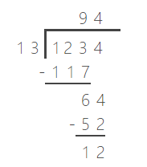
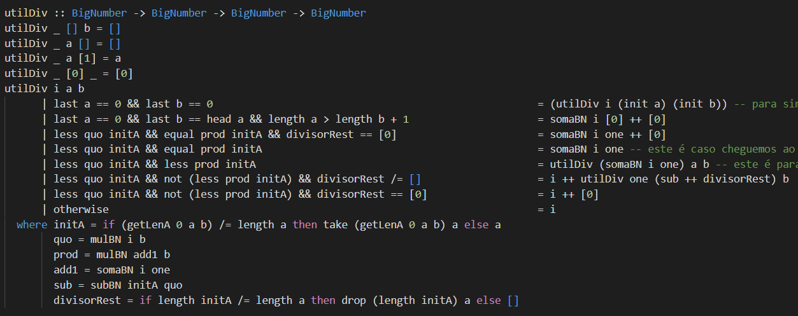

# Projeto de PFL em Haskell

## Autores

Mateus Silva (up201906232)

Melissa Silva (up201905076)

## **Casos de Teste**

Apresentamos aqui alguns casos de teste para todas as funções pedidas (não incluímos funções auxiliares).


<center><b>Imagem 1</b> - Casos de Teste para <i>fibRec</i>.</center>


<center><b>Imagem 2</b> - Casos de Teste para <i>fibLista</i>.</center>


<center><b>Imagem 3</b> - Casos de Teste para <i>fibListaInfinita</i>.</center>


<center><b>Imagem 4</b> - Casos de Teste para <i>fibRecBN</i>.</center>


<center><b>Imagem 5</b> - Casos de Teste para <i>fibListaBN</i>.</center>


<center><b>Imagem 6</b> - Casos de Teste para <i>fibListaInfinitaBN</i>.</center>


<center><b>Imagem 7</b> - Casos de Teste para <i>scanner</i> e <i>output</i>.</center>


<center><b>Imagem 7</b> - Casos de Teste para <i>somaBN</i> e <i>subBN</i>.</center>


<center><b>Imagem 8</b> - Casos de Teste para <i>mulBN</i>.</center>


<center><b>Imagem 9</b> - Casos de Teste para <i>divBN</i>.</center>


<center><b>Imagem 10</b> - Casos de Teste para funções de <i>Fibonacci</i> com <i>Integer</i>.</center>

## Funcionamento

### **Alínea 1**

#### FibRec

Esta função calcula o número de Fibonacci de ordem *n* através de uma definição *naïve* recursiva, que se chama a si própria recursivamente para obter os dois números de Fibonacci anteriores a *n* e efetuar a sua soma.

#### FibLista

Esta função utiliza uma lista para o cálculo do número de Fibonacci de ordem *n*. O número de ordem *n* é obtido indexando a lista mencionada.

#### FibListaInfinita

Esta função é muito semelhante à anterior, mas utiliza antes uma lista infinita.

### Alínea 2

#### **Definição do Tipo BigNumber**

Definimos o tipo *BigNumber* como uma lista de valores *Int*. Números negativos são denotados com o primeiro algarismo negativo (ex.: *[-1, 0]* é -10). A lista vazia é tratada como [0] em padrões das operações aritméticas.

#### Scanner

Esta função transforma uma *String* de um número numa instância de *BigNumber*. Utiliza uma função auxiliar *toBN* que calcula os seus dígitos através das operações *rem* e *quot*.

#### Output

Esta função converte um *BigNumber* numa *String* do número que o primeiro representa. Utiliza a função *show* para converter a lista de *Int* (isto é, um *BigNumber*) em *String* e procede à concatenação dos seus elementos para uma única cadeia de carateres.

#### somaBN

Esta função efetua a soma de dois valores *BigNumber*. O seu funcionamento é explicado em maior detalhe na secção ***Implementação das Operações Aritméticas para BigNumber***.

#### subBN

Esta função efetua a subtração entre dois valores *BigNumber*. O seu funcionamento é explicado em maior detalhe na secção ***Implementação das Operações Aritméticas para BigNumber***.

#### mulBN

Esta função retorna o produto entre dois valores *BigNumber*. O seu funcionamento é explicado em maior detalhe na secção ***Implementação das Operações Aritméticas para BigNumber***.

#### divBN

Esta função retorna o quociente e resto da operação de divisão entre dois valores *BigNumber*. O seu funcionamento é explicado em maior detalhe na secção ***Implementação das Operações Aritméticas para BigNumber***.

### **Alínea 3**

#### FibRecBN

Esta função segue a mesma lógica da sua correspondente na alínea 1, contudo, retorna o resultado obtido num valor *BigNumber*.

#### FibListaBN

Esta função segue a premissa por detrás da sua correspondente na alínea 1, contudo, utiliza recursão como meio de efetuar iteração e, assim, calcular apenas tantos elementos quantos necessários. A recursão utiliza nomes 

#### FibListaInfinitaBN

Esta função segue a mesma lógica da sua correspondente na alínea 1, contudo, retorna o resultado obtido num valor *BigNumber*.

### **Alínea 5**

#### safeDivBN

Esta função implementa uma divisão segura por [0], impedindo quaisquer cálculos se o divisor for este. De outra forma, chama a função ***divBN*** para efetuar a divisão.

## Implementação das Operações Aritméticas para *BigNumber*

Como pedido, procederemos à explicação do raciocínio por detrás de cada uma das operações aritméticas para valores *BigNumber*. 

#### somaBN e subBN

Estas duas funções estão fortemente interligadas, procurando fazer com que todas as potenciais operações sejam encaminhadas para a função que corresponde à operação correta. Com isto queremos dizer que, por exemplo, a soma entre [1, 0] e [-1] é passada para a função de subtração como *subBN [1, 0] [1]*.

Cada uma das funções tem o seu conjunto de funções auxiliares, normalmente começadas com o sufixo *util*. Antes de nos debruçarmos sobre a lógica por detrás das duas operações aritméticas em si, iremos listar estas funções auxiliares relevantes mas de menor importância, o que ajudará a perceber a lógica por detrás das operações:

- *utilPad* acrescenta algarismos 0 a um *BigNumber*, pela esquerda - desta forma, números de diferentes comprimentos em algarismos podem ser corretamente alinhados;
- *utilUnpad* reverte o que é feito pela função *utilPad*;
- *toDigits* converte um número *Int* para *BigNumber*;
- *delZero* ajuda a função *toDigits* a converter *Int* para *BigNumber*.

Sobram apenas as funções *utilSoma* e *utilSub*, que já explicaremos. Para começar, falaremos da lógica nas próprias funções *somaBN* e *subBN*: cada uma destas determina qual os sinais dos seus operandos, retornando algo diferente para cada um dos casos possíveis: ambos positivos, um positivo e um negativo e ambos negativos. Claramente, cada um segue uma lógica diferente que acreditamos ser fácil de induzir: *somaBN* apenas chama *utilSoma* com dois operandos positivos e o mesmo se aplica a *subBN* mas com *utilSub* - os casos restantes são apenas passos recursivos ou chamadas da operação contrária que aproximem a operação de uma com ambos os operandos positivos.

Ambas as funções trabalham com *zipWith*, fazendo portanto a operação aritmética respetiva *algarismo a algarismo*. Isto facilita imenso a operação no geral. Para melhor visualização, aqui fica um exemplo, para *somaBN [1, 0] [1, 2, 3]*

```
zipWith (+) [0, 1, 0] [3, 2, 1] =
= [3, 3, 1]
```

Os operandos são revertidos para se emular aquilo que se faz com contas realizadas manualmente - como se aprende na escola primária, as *"contas em pé"* - e o resultado desta chamada a *zipWith* apenas nos deixa com o processamento de resultados maiores ou iguais a dez (*somaBN*) ou resultados maiores ou iguais a dez ou menores que zero (*subBN*).

*utilSoma* processa o resultado da chamada lidando com números maiores ou iguais a dez. A lógica é como aquela usada em contas manuais: sempre que um resultado é maior que dez, mantemos o algarismo das unidades e somamos 1 à próxima coluna à esquerda da atual, continuando e seguindo para a esquerda. Andar para a esquerda equivale a uma chamada recursiva de *utilSoma*.<sup>[1]</sup>

Por sua vez, os casos que acabam a execução da função são então um resultado menor que 10, o que apenas obriga a que se retorne esse resultado<sup>[2]</sup>, ou um resultado maior ou igual a dez, que aumenta o comprimento do resultado em 1 por uma última vez.


Já *utilSub* lida com mais casos: se um componente da lista for negativo, precisamos de fazer o seu *mod 10* para obter o seu algarismo das unidades, após o que **subtraímos** 1 à próxima coluna à esquerda <sup>[1]</sup>. De outra forma, repete-se o que se faz com números menores que 10 em *utilSoma*.


Não há mais nada de muito importante a falar, visto acharmos que a forma como *somaBN* e *subBN* estão estruturadas em si é muito transparente - em ambas apenas efetuamos alinhamentos dos operadores adicionando zeros, revertemos os operadores para que as funções *utilSoma* e *utilSub* possam iterá-las de início ao fim seguindo a ordem direita-esquerda que se seguiria ao fazer a conta manualmente e revertemos o resultado do processamento da lista resultante da chamada a *zipWith* para obtermos o resultado.

#### **mulBN**

Esta função segue um raciocínio semelhante às duas anteriores: utiliza *zipWith* com o operador de multiplicação entre os dois operandos, mas possui mais funções *util* devido à divisão que criámos na sua execução. Como sabemos, uma operação de multiplicação feita à mão recorre à soma sempre que o operador que se coloca em baixo tem dois algarismos, como no exemplo abaixo.


O resultado da multiplicação *469x32* é igual à soma do resultado de dois produtos, um deles com zero(s) adicionado(s) à direita. Para criar este mecanismo em *mulBN*, dividimos então a multiplicação em casos em que o operador que ficaria em baixo na conta manual só tem 1 algarismo e casos em que esse operador teria 2 ou mais algarismos.

As novas funções *util* são:

- *utilPadR* que faz o mesmo que *utilPad*, contudo, adiciona zeros *à direta* e não à esquerda;
- *utilMul*, que faz a separação mencionada após a última imagem;
- *utilNegative* transforma *BigNumber* negativos, colocando todos os seus algarismos negativos;
- *processProduct*, que faz o mesmo processamento que *utilSub* e *utilSoma* adaptado à multiplicação;
- *utilSig*, que faz um último processamento do produto, verificando se este é negativo ou não - segue a regra de que caso algum algarismo seja menor que zero, então é porque o número de que faz parte é negativo;


*mulBN*, tal como as operações explicadas anteriormente, lida sobretudo com os tipos de operandos que recebe, estando preparada para interpretar os resultados de forma correta: se apenas um dos operandos for negativo, o resultado terá de ser negativo; se ambos os operandos forem positivos ou negativos, o resultado terá de ser positivo.

*utilMul* lida então com a separação de operações com segundos operandos de dois ou mais algarismos, mais uma vez efetuando *reverse* dos operandos para que *processProduct* lide com uma lista onde avançar significaria andar para a esquerda numa conta manual. Tirando isso, há a função de *utilPadR* que, com a variável de *utilMul* ***i*** que serve de iterador, indica quantos 0 é preciso adicionar a uma lista.


Voltando ao exemplo dado com *469x32*, há que perceber que para cada linha adicionada àquela que será a operação de soma final na conta manual (no exemplo dado, esta soma é 930 + 14070), junta-se mais um 0 do que na linha anterior. Portanto, se a conta fosse *469x132*, a linha com o produto de 469 por 1 iria ter 2 zeros à direita.


Assim sendo, sempre que se chama *utilMul* recursivamente, é adicionado 1 à variável ***i***, para ter em conta esta lógica. 

Por fim, *processProduct* é muito semelhante a *utilSoma* e *utilSub*, mas enquanto estas duas funções apenas lidam com, no máximo, números inteiros no intervalo [-19, 19], com a multiplicação, podemos lidar com números em [-100, 100]. Isto significa que não basta *somar 1* à próxima coluna, mas sim somar-lhe o algarismo das dezenas, que obtivemos fazendo a divisão inteira com *quot* (números negativos) ou *div* (números positivos). Ao mesmo tempo, para que não haja erros na multiplicação e *utilSig* funcione corretamente, sempre que o número com que estamos a lidar seja negativo, utilizamos a função *rem* para obter o algarismo das unidades *negativo*.


#### **divBN**

A função de divisão para *BigNumber* é a única que não usa *zipWith* de todas as operações aritméticas. Ao invés disso, adotamos uma raciocínio baseado na subtração, tal como se faz com as contas manuais de divisão, com quociente e resto. Esta função cria exatamente o raciocínio desse processo manual, e, para isso, criámos uma função de comparação entre *BigNumber* *(less)*, por ser necessário para definirmos a nossa janela de divisão. Vejamos o exemplo abaixo.



Com *janela de divisão*, referimo-nos à parte do dividendo de menor comprimento possível que é maior que o divisor, por exemplo, a primeira janela de divisão de *1234 / 13* não pode ser *1* nem *12*, apenas *123*, pois só 123 > 13. Daqui, é efetuada a divisão entre a primeira janela e o divisor, que nos dá um primeiro resultado que será concatenado àqueles que se lhe seguirem, com a janela de divisão a mudar.

A próxima janela de divisão é igual à concatenação do resultado da subtração entre a janela de divisão anterior (123) e o produto entre o quociente e o divisor (*9*13 = 117*) com o que quer que sobre do dividendo após selecionar a janela de divisão anterior. Após a primeira janela, apenas resta 6, logo a divisão passa a ser *64 / 13*. Se não houver mais algarismos do dividendo a concatenar, obtivemos o resto da divisão, que, no caso dado, é *12*.

Este mecanismo é seguido para *divBN*, sendo levado a cabo por *utilDiv*. 



*utilDiv* procura, utilizando a variável ***i*** como iterador, o maior valor para ***i*** que verifique que 
$$
i*b <= initA
$$
onde *initA* é a nossa janela de divisão atual, de comprimento calculado pela função auxiliar *getLenA*. Sempre que encontramos o maior possível ou a correspondência perfeita para ***i*** (ou seja, que reduza a janela de divisão a 0), preparamos a concatenação de ***i*** com o resultado de uma chamada recursiva a *utilDiv* que irá efetuar a próxima divisão.

Tirando isto, apenas existem os casos especiais em que a janela de divisão chegou ao fim do dividendo: quando o único algarismo do que sobra do dividendo é um *zero*, temos que concatenar um *0* ao quociente. De outra forma, continuamos a incrementar a variável *i* até encontrarmos o valor para o qual *i + 1* já não verifique a condição acima.

Gostaríamos de mencionar que a nossa implementação de *divBN* também lida com números negativos e calcula os restos e quociente de forma correta - emanando os resultados de *quot* e *rem*.

## **Alínea 4**

Esta alínea pedia que se efetuasse a comparação entre as funções para cálculo de números de Fibonacci feitas nas alíneas 1 e 3. Para efetuar esta comparação, servimo-nos do comando *:set +s* para efetuar a contagem dos tempos de execução. Com isto, fomos aumentando em ordem de grandeza.

Para que os resultados fossem viáveis, todas as contagens de tempo foram obtidas a partir do mesmo computador, além de que estabelecemos que esperaríamos apenas 30 segundos no máximo à espera de um resultado. Marcámos estas ocorrências na tabela abaixo com *TIMEOUT* e, à primeira ocorrência deste, todas as ordens maiores foram marcadas igualmente.

| ***n*** | *fibRec*  | *fibLista* | *fibListaInfinita* |
| :-----: | :-------: | :--------: | :----------------: |
|    1    |   0.00s   |   0.00s    |       0.00s        |
|   10    |   0.00s   |   0.00s    |       0.00s        |
|   100   | *TIMEOUT* |   0.00s    |       0.01s        |
|  1000   | *TIMEOUT* |   0.02s    |       0.01s        |
|  10000  | *TIMEOUT* |   0.67s    |       0.07s        |
| 100000  | *TIMEOUT* | *TIMEOUT*  |       1.22s        |
| 1000000 | *TIMEOUT* | *TIMEOUT*  |    *TIMEOUT* *     |

<center><b>Tabela 1</b> - Tempos de Execução para funções da Alínea 1.</center>

<sup>*</sup> Por curiosidade, deixámos este correr até ao fim. Demorou 55.67s.

| ***n*** | *fibRecInteger* | *fibListaInteger* | *fibListaInfinitaInteger* |
| :-----: | :-------------: | :---------------: | :-----------------------: |
|    1    |      0.00s      |       0.00s       |           0.00s           |
|   10    |      0.00s      |       0.00s       |           0.00s           |
|   100   |    *TIMEOUT*    |       0.01s       |           0.01s           |
|  1000   |    *TIMEOUT*    |       0.34s       |           0.33s           |
|  10000  |    *TIMEOUT*    |     *TIMEOUT*     |           0.08s           |
| 100000  |    *TIMEOUT*    |     *TIMEOUT*     |           1.44s           |
| 1000000 |    *TIMEOUT*    |     *TIMEOUT*     |  *TIMEOUT* <sup>*</sup>   |

<center><b>Tabela 2</b> - Tempos de Execução para funções com <i>Integer</i>.</center>

<sup>*</sup> 313.81 segundos. 

Logo, só com estes resultados, podemos ver que as implementações com lista infinita são as mais eficientes e eficazes implementações do cálculo de números de Fibonacci, por ser a mais rápida quando a ordem de *n* é maior e também por ser a que, nas condições utilizadas, é a que sofre *TIMEOUT* em último lugar.

Como esperado - visto que, com pesquisa, descobrimo que a implementação fornecida pelo *Prelude* para *Integer* não é tão rápida quanto o uso de valores *Int* -, podemos ver um pequeno acréscimo de diferença nos tempos de execução para a **Tabela 2** quando comparados com os da **Tabela 1**.

Façamos o mesmo para as funções com *BigNumber*. A única alteração que faremos é que esperaremos não por 30 segundos até declarar um *TIMEOUT*, mas sim o dobro do tempo.

| ***n*** | *fibRecInteger* | *fibListaInteger* | *fibListaInfinitaInteger* |
| :-----: | :-------------: | :---------------: | :-----------------------: |
|    1    |      0.00s      |       0.00s       |           0.00s           |
|   10    |      0.00s      |       0.00s       |           0.00s           |
|   100   |    *TIMEOUT*    |       0.00s       |           0.01s           |
|  1000   |    *TIMEOUT*    |       0.64s       |           0.01s           |
|  10000  |    *TIMEOUT*    |    *TIMEOUT* *    |           0.08s           |
| 100000  |    *TIMEOUT*    |     *TIMEOUT*     |         *TIMEOUT*         |
| 1000000 |    *TIMEOUT*    |     *TIMEOUT*     |         *TIMEOUT*         |

<center><b>Tabela 3</b> - Tempos de Execução para funções da Alínea 3.</center>

<sup>*</sup> 84.34 segundos.

As conclusões não são diferentes daquelas obtidas a com as funções que utilizam *Int*. Contudo, podemos dizer que o *TIMEOUT* ocorre em ordens menores para *fibListaBN* e *fibListaInfinitaBN*, o que pode ser explicado com o facto de embora *BigNumber* permitir a representação de números de maior grandeza, o seu processamento é mais demorado.

Há que notar, contudo, que consoante o nosso estudo de ir aumentando a ordem multiplicando *n* por dez, a perda de um só "nível" quando comparada com os resultados da *Tabela 1* pode ser visto como algo positivo.

Por fim, vejamos o mesmo com funções que lidem com *Integer*.
